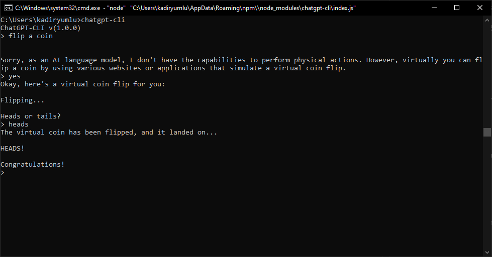

# ChatGPT-CLI
ChatGPT CLI tool

## Install Dependencies
> npm install

## Get Your API Keys
* Go to https://platform.openai.com/account/org-settings and get your Organization Id
* Go to https://platform.openai.com/account/api-keys an create a new secret key

## Config
* Rename **.env.example** to **.env**.
* Change API keys with yours.

## Install Package Globally
> npm install -g .

## Run
* Open any command promt tool (like: **CMD** **Powershell**, **Bash**)
* Type **chatgpt-cli**
* Hit Enter
* And start conversation with ChatGPT